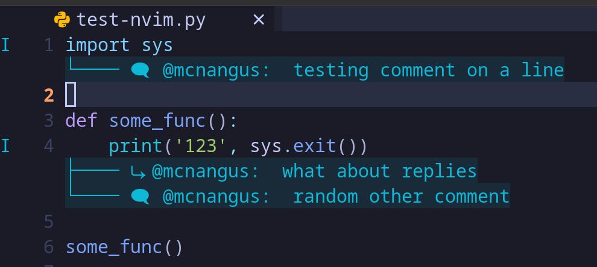

# pr-comments.nvim
Use [lsp_lines](https://git.sr.ht/~whynothugo/lsp_lines.nvim) to load pr comments into neovim using vim quickfix list and diagnostics

Example:



## Requirements

- Requires [gh](https://cli.github.com/), follow installation steps in the link.
- Requires [lsp_lines](https://git.sr.ht/~whynothugo/lsp_lines.nvim), follow installation steps in the link.

## Installation

### Lazy

```lua
{
    'mcnangus/pr-comments.nvim',
    config = function()
        -- Call the function to load the quickfix list as diagnostics
        vim.keymap.set('', '<Leader>k', require('pr-comments').fetch, { desc = 'Toggle gh pr comments' })
    end,
}
```

